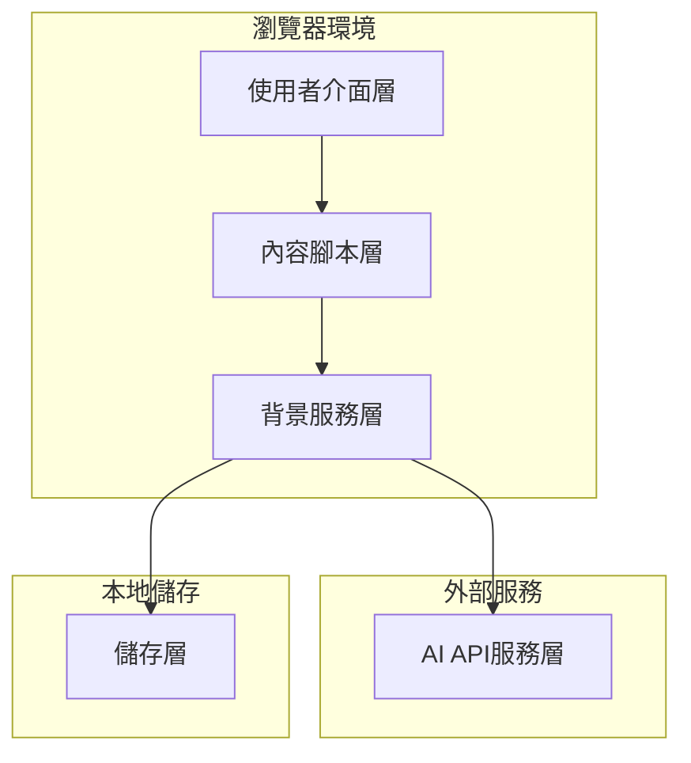

# 設計文件

## 概述

Web Translation Extension 是一個瀏覽器外掛，專為非英文母語者設計，提供英文網頁的中英對照翻譯功能。外掛採用模組化架構，支援多種AI翻譯服務，具備智能內容分析、快取機制和漸進式翻譯顯示等功能。

### MVP範圍

**MVP版本包含的核心功能：**
- Chrome/Edge瀏覽器支援 (Manifest V3)
- 基本的點擊翻譯功能
- 支援5種主要AI翻譯服務
- 簡單的設定介面
- 基本的翻譯快取
- 段落級別的翻譯顯示

**延後到後續版本的功能：**
- Firefox瀏覽器支援
- 動態內容檢測 (MutationObserver)
- 廣告過濾功能
- 進階使用量統計
- 複雜的錯誤恢復機制
- 效能最佳化 (批次處理、Web Workers)
- 進階安全功能

## 架構

### 整體架構



### 技術架構選擇 (MVP版本)

- **外掛格式**: Manifest V3 (Chrome/Edge優先，Firefox後續支援)
- **前端框架**: Vanilla JavaScript + CSS (輕量化考量)
- **AI API**: 支援多種服務
  - OpenAI GPT (GPT-3.5/GPT-4)
  - Google Gemini (透過Google AI Studio API)
  - Claude (Anthropic API)
  - Bing Translator (Microsoft Translator API)
  - Google Translate API (傳統翻譯服務)
- **儲存**: Chrome Storage API (同步設定) + 簡化的本地快取
- **內容檢測**: 基本DOM查詢 (MutationObserver後續加入)

## 元件和介面

### 1. 使用者介面元件

#### 1.1 翻譯控制按鈕
```javascript
interface TranslationButton {
  position: 'floating' | 'toolbar';
  state: 'idle' | 'translating' | 'completed' | 'error';
  toggleTranslation(): void;
  showProgress(percentage: number): void;
}
```

#### 1.2 設定面板
```javascript
interface SettingsPanel {
  apiConfig: APIConfiguration;
  translationPreferences: TranslationPreferences;
  usageStatistics: UsageStats;
  saveSettings(): Promise<void>;
  validateAPIKey(): Promise<boolean>;
}
```

### 2. 內容處理元件

#### 2.1 內容分析器
```javascript
interface ContentAnalyzer {
  detectTextNodes(): TextNode[];
  segmentText(text: string): TextSegment[];
  filterAdvertisements(nodes: TextNode[]): TextNode[];
  prioritizeContent(segments: TextSegment[]): TextSegment[];
}
```

#### 2.2 翻譯渲染器
```javascript
interface TranslationRenderer {
  insertTranslation(segment: TextSegment, translation: string): void;
  removeTranslations(): void;
  updateTranslationVisibility(visible: boolean): void;
  preserveOriginalLayout(): void;
}
```

### 3. 背景服務元件

#### 3.1 翻譯管理器
```javascript
interface TranslationManager {
  translateSegments(segments: TextSegment[]): Promise<Translation[]>;
  batchTranslate(segments: TextSegment[]): Promise<Translation[]>;
  handleAPIErrors(error: APIError): void;
  trackUsage(tokens: number): void;
}
```

#### 3.2 快取管理器
```javascript
interface CacheManager {
  getCachedTranslation(text: string): Promise<string | null>;
  setCachedTranslation(text: string, translation: string): Promise<void>;
  clearExpiredCache(): Promise<void>;
  getCacheStats(): Promise<CacheStats>;
}
```

## 資料模型

### 1. 翻譯相關模型

```javascript
interface TextSegment {
  id: string;
  text: string;
  element: HTMLElement;
  priority: 'high' | 'medium' | 'low';
  type: 'title' | 'paragraph' | 'list' | 'other';
  isVisible: boolean;
}

interface Translation {
  segmentId: string;
  originalText: string;
  translatedText: string;
  timestamp: number;
  apiProvider: string;
  tokensUsed: number;
}
```

### 2. 設定模型

```javascript
interface APIConfiguration {
  provider: 'openai' | 'google-gemini' | 'claude' | 'bing-translator' | 'google-translate';
  apiKey: string;
  endpoint?: string;
  model?: string;
  maxTokensPerRequest: number;
}

// 各服務的具體配置
interface ServiceConfigs {
  openai: { model: 'gpt-3.5-turbo' | 'gpt-4' };
  'google-gemini': { model: 'gemini-pro' | 'gemini-pro-vision' };
  claude: { model: 'claude-3-sonnet' | 'claude-3-haiku' };
  'bing-translator': { region: string };
  'google-translate': { projectId?: string };
}

interface TranslationPreferences {
  targetLanguage: string;
  showOriginalText: boolean;
  translationPosition: 'below' | 'inline' | 'tooltip';
  autoTranslateVisible: boolean;
  excludeSelectors: string[];
}
```

### 3. 統計模型

```javascript
interface UsageStats {
  totalTranslations: number;
  tokensUsed: number;
  estimatedCost: number;
  lastResetDate: Date;
  dailyUsage: DailyUsage[];
}

interface DailyUsage {
  date: string;
  translations: number;
  tokens: number;
  cost: number;
}
```

## 錯誤處理

### 1. API錯誤處理策略

- **網路錯誤**: 自動重試機制 (指數退避)
- **API限制**: 請求佇列管理和速率限制
- **認證錯誤**: 提示使用者更新API金鑰
- **配額超限**: 顯示使用量警告和建議

### 2. 內容處理錯誤

- **DOM變更**: 使用MutationObserver重新分析
- **翻譯失敗**: 標記失敗項目，提供重試選項
- **渲染錯誤**: 回退到原始內容顯示

### 3. 使用者體驗錯誤處理

```javascript
interface ErrorHandler {
  handleAPIError(error: APIError): void;
  handleNetworkError(error: NetworkError): void;
  showUserFriendlyMessage(error: Error): void;
  logErrorForDebugging(error: Error): void;
}
```

## 測試策略

### 1. 單元測試

- **內容分析**: 測試文本分割和優先級排序
- **翻譯邏輯**: 模擬API回應和錯誤情況
- **快取機制**: 驗證儲存和檢索邏輯
- **使用量統計**: 確保準確的使用量追蹤

### 2. 整合測試

- **API整合**: 測試與各種翻譯服務的整合
- **瀏覽器相容性**: 在Chrome、Firefox、Edge上測試
- **動態內容**: 測試SPA和動態載入內容的處理

### 3. 端到端測試

- **使用者流程**: 從安裝到翻譯的完整流程
- **效能測試**: 大型網頁的翻譯效能
- **錯誤恢復**: 網路中斷和API錯誤的恢復能力

### 4. 測試環境設定

```javascript
interface TestEnvironment {
  mockAPIResponses: MockAPIResponse[];
  testWebPages: TestPage[];
  performanceMetrics: PerformanceMetric[];
  setupMockAPI(): void;
  teardownTests(): void;
}
```

## 效能考量

### 1. 內容處理最佳化

- **懶載入**: 只處理可見區域的內容
- **批次處理**: 將多個小段落合併為單一API請求
- **防抖動**: 避免頻繁的DOM變更觸發重複處理

### 2. API使用最佳化

- **智能分割**: 根據API限制最佳化文本分割
- **請求合併**: 將相近的翻譯請求合併
- **快取策略**: 實施LRU快取和過期機制

### 3. 記憶體管理

- **DOM引用清理**: 避免記憶體洩漏
- **快取大小限制**: 設定合理的快取上限
- **背景處理**: 使用Web Workers處理大量文本

## 安全性考量

### 1. API金鑰保護

- **加密儲存**: 使用瀏覽器的安全儲存API
- **傳輸安全**: 確保HTTPS通訊
- **金鑰驗證**: 定期驗證API金鑰有效性

### 2. 內容安全

- **XSS防護**: 清理和驗證插入的翻譯內容
- **CSP相容**: 確保與網站的內容安全政策相容
- **隱私保護**: 不儲存敏感的使用者內容

### 3. 權限管理

```javascript
interface SecurityManager {
  validateAPIKey(key: string): Promise<boolean>;
  sanitizeTranslationContent(content: string): string;
  checkCSPCompliance(element: HTMLElement): boolean;
  encryptSensitiveData(data: any): string;
}
```