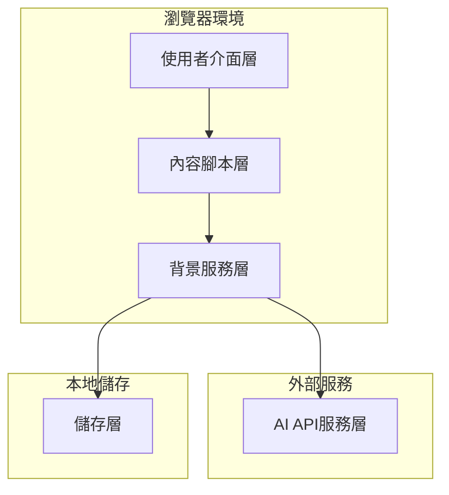
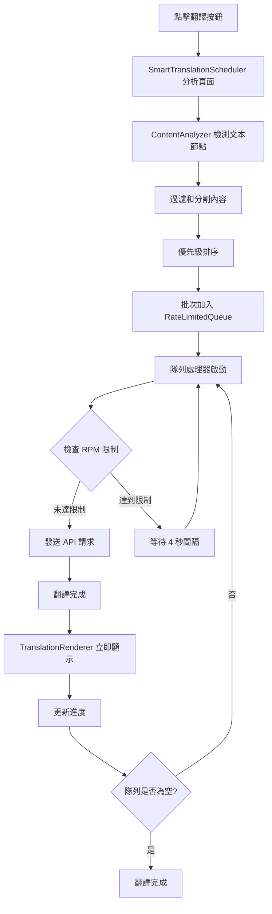

# 設計文件

## 概述

Web Translation Extension 是一個瀏覽器外掛，專為非英文母語者設計，提供英文網頁的中英對照翻譯功能。外掛採用模組化架構，支援多種AI翻譯服務，具備智能內容分析、快取機制和漸進式翻譯顯示等功能。

### MVP範圍

**MVP版本包含的核心功能：**
- Chrome/Edge瀏覽器支援 (Manifest V3)
- 基本的點擊翻譯功能
- 支援5種主要AI翻譯服務
- 簡單的設定介面
- 基本的翻譯快取
- 段落級別的翻譯顯示

**延後到後續版本的功能：**
- Firefox瀏覽器支援
- 動態內容檢測 (MutationObserver)
- 廣告過濾功能
- 進階使用量統計
- 複雜的錯誤恢復機制
- 效能最佳化 (批次處理、Web Workers)
- 進階安全功能

## 架構

### 整體架構



### 智能翻譯排程系統 (Smart Translation Scheduling) 設計

#### 核心概念
為了優化 API 配額使用和提升用戶體驗，系統採用基於隊列的智能翻譯排程策略：

1. **全頁面分析**: 用戶點擊翻譯按鈕時，立即分析整個頁面內容
2. **智能排程**: 根據優先級將所有翻譯任務加入隊列
3. **速率限制**: 嚴格遵守 API 的 RPM (Requests Per Minute) 限制
4. **漸進式顯示**: 翻譯完成後立即顯示，提供即時反饋

#### 翻譯隊列架構


#### Rate-Limited Translation Queue 系統
```javascript
class RateLimitedTranslationQueue {
    constructor(options = {}) {
        // API 速率限制配置 (基於 Gemini API 限制)
        this.rpmLimit = options.rpmLimit || 15; // Gemini 2.5 Flash-Lite: 15 RPM
        this.tpmLimit = options.tpmLimit || 250000; // Tokens Per Minute
        this.rpdLimit = options.rpdLimit || 1000; // Requests Per Day
        
        // 隊列管理 - MVP 版本使用簡單陣列
        this.queue = [];
        this.processedSegments = new Set(); // 避免重複翻譯
        
        // 請求歷史追蹤
        this.requestHistory = []; // 記錄最近請求時間
        this.tokenHistory = []; // 記錄最近 token 使用量
        
        // 每日使用量追蹤
        this.dailyUsage = {
            requests: 0,
            tokens: 0,
            date: new Date().toDateString()
        };
        
        // 處理狀態
        this.isProcessing = false;
        this.processingInterval = null;
        this.currentSegment = null;
        
        // 事件回調
        this.onProgress = null;
        this.onComplete = null;
        this.onError = null;
    }
}
```

#### 智能優先級排序
```javascript
// 當前實現的優先級計算邏輯
const PRIORITY_WEIGHTS = {
    isInViewport: 100,      // 當前視窗內容最高優先級
    isTitle: 80,            // 標題和重要標頭
    isImportant: 60,        // 重要段落
    documentOrder: 1        // 文檔順序基礎權重
};

// 實際實現中的優先級計算
function calculatePriority(segment) {
    let priority = 0;
    
    // 視窗內容優先
    if (this.isInViewport(segment.element)) {
        priority += this.options.priorityWeights.isInViewport;
    }
    
    // 標題類型優先
    if (segment.type === 'title') {
        priority += this.options.priorityWeights.isTitle;
    }
    
    // 重要內容優先 (基於長度和可見性)
    if (segment.isVisible && segment.text.length > 20) {
        priority += this.options.priorityWeights.isImportant;
    }
    
    // 文檔順序權重
    priority += this.options.priorityWeights.documentOrder * (1000 - segment.index);
    
    return priority;
}
```

#### API 速率限制管理

**📚 參考文檔**: [Google Gemini API 速率限制](https://ai.google.dev/gemini-api/docs/rate-limits?hl=zh-tw)  
**📋 詳細配置**: 參見 `API_RATE_LIMITS.md`

```javascript
// 基於實際 Gemini API 限制的配置 (免費方案)
const API_LIMITS = {
    'gemini-2.5-pro': { rpm: 5, tpm: 250000, rpd: 100 },
    'gemini-2.5-flash': { rpm: 10, tpm: 250000, rpd: 250 },
    'gemini-2.5-flash-lite': { rpm: 15, tpm: 250000, rpd: 1000 },
    'gemini-2.0-flash': { rpm: 15, tpm: 1000000, rpd: 200 },
    'gemini-2.0-flash-lite': { rpm: 30, tpm: 1000000, rpd: 200 }
};

// 當前預設使用: gemini-2.5-flash-lite (15 RPM = 每4秒一個請求)

class RateLimitManager {
    canSendRequest() {
        const now = Date.now();
        const oneMinuteAgo = now - 60000;
        const oneDayAgo = now - 86400000;
        
        // 清理過期記錄
        this.requestHistory = this.requestHistory.filter(time => time > oneMinuteAgo);
        this.tokenHistory = this.tokenHistory.filter(record => record.time > oneMinuteAgo);
        
        // 檢查各種限制
        const rpmCheck = this.requestHistory.length < this.rpmLimit;
        const tpmCheck = this.getTotalTokensInLastMinute() < this.tpmLimit;
        const rpdCheck = this.dailyUsage.requests < this.rpdLimit;
        
        return rpmCheck && tpmCheck && rpdCheck;
    }
    
    getWaitTime() {
        // 計算需要等待多長時間才能發送下一個請求
        if (this.requestHistory.length >= this.rpmLimit) {
            const oldestRequest = Math.min(...this.requestHistory);
            return Math.max(0, 60000 - (Date.now() - oldestRequest));
        }
        return 0;
    }
}
```

#### 內容過濾策略 (當前實現)
```javascript
// 簡化的內容過濾邏輯 - 基於 HTML 結構而非內容判斷
class ContentFilter {
    filterTextNodes(textNodes) {
        return textNodes.filter(node => {
            const text = node.textContent.trim();
            
            // 只排除明確不需要翻譯的內容
            if (!text || text.length === 0) return false;
            if (text.length > this.options.maxTextLength) return false;
            
            // 基於 HTML 標籤的過濾
            if (this.isSpecialElement(node)) return false; // code, button, img 等
            if (this.isAlreadyTranslated(node)) return false;
            if (this.isTranslationSystemElement(node)) return false;
            
            return true;
        });
    }
    
    isSpecialElement(node) {
        // 檢查特殊 HTML 標籤
        const skipTags = [
            'code', 'pre', 'kbd', 'samp', 'var',  // 代碼相關
            'script', 'style', 'noscript',        // 腳本和樣式
            'button', 'input', 'select', 'textarea', // 表單元素
            'img', 'svg', 'canvas',               // 圖像元素
            'audio', 'video',                     // 媒體元素
            'iframe', 'embed', 'object'           // 嵌入元素
        ];
        
        // 檢查元素及其父元素
        let element = node.parentElement;
        while (element && element !== document.body) {
            if (skipTags.includes(element.tagName.toLowerCase())) return true;
            element = element.parentElement;
        }
        
        return false;
    }
}
```

#### 用戶體驗優化
```javascript
// 翻譯進度反饋系統 (當前實現)
class TranslationProgressManager {
    updateProgress(current, total) {
        const percentage = Math.round((current / total) * 100);
        
        // 更新翻譯按鈕狀態
        if (this.translationButton) {
            this.translationButton.showProgress(percentage);
            this.translationButton.updateTooltip(`翻譯進度: ${current}/${total} (${percentage}%)`);
        }
        
        // 控制台日誌
        console.log(`翻譯進度: ${current}/${total} (${percentage}%)`);
        
        // 觸發進度事件
        if (this.onProgress) {
            this.onProgress(current, total);
        }
    }
    
    calculateEstimatedTime(remainingTasks) {
        // 基於 15 RPM 限制 (每 4 秒一個請求)
        const secondsPerRequest = 4;
        const estimatedSeconds = remainingTasks * secondsPerRequest;
        return this.formatTime(estimatedSeconds);
    }
}
```

#### 錯誤處理和重試機制
```javascript
class TranslationErrorHandler {
    handleAPIError(error, segment) {
        switch (error.type) {
            case 'RATE_LIMIT_EXCEEDED':
                // 重新加入隊列，等待下次處理
                this.requeueSegment(segment, { delay: error.retryAfter || 60000 });
                break;
                
            case 'QUOTA_EXCEEDED':
                // 暫停翻譯，通知用戶
                this.pauseTranslation();
                this.notifyQuotaExceeded();
                break;
                
            case 'NETWORK_ERROR':
                // 指數退避重試
                this.retryWithBackoff(segment);
                break;
                
            default:
                // 標記為失敗，提供手動重試選項
                this.markAsFailed(segment, error);
        }
    }
}
```

### 技術架構選擇 (MVP版本)

- **外掛格式**: Manifest V3 (Chrome/Edge優先，Firefox後續支援)
- **前端框架**: Vanilla JavaScript + CSS (輕量化考量)
- **AI API**: 支援多種服務
  - OpenAI GPT (GPT-3.5/GPT-4)
  - Google Gemini (透過Google AI Studio API)
  - Claude (Anthropic API)
  - Bing Translator (Microsoft Translator API)
  - Google Translate API (傳統翻譯服務)
- **儲存**: Chrome Storage API (同步設定) + 簡化的本地快取
- **內容檢測**: 基本DOM查詢 (MutationObserver後續加入)

## 元件和介面

### 1. 使用者介面元件

#### 1.1 翻譯控制按鈕
```javascript
interface TranslationButton {
  position: 'floating' | 'toolbar';
  state: 'idle' | 'translating' | 'completed' | 'error';
  toggleTranslation(): void;
  showProgress(percentage: number): void;
}
```

#### 1.2 設定面板
```javascript
interface SettingsPanel {
  apiConfig: APIConfiguration;
  translationPreferences: TranslationPreferences;
  usageStatistics: UsageStats;
  saveSettings(): Promise<void>;
  validateAPIKey(): Promise<boolean>;
}
```

### 2. 內容處理元件

#### 2.1 內容分析器
```javascript
interface ContentAnalyzer {
  detectTextNodes(): TextNode[];
  segmentText(text: string): TextSegment[];
  filterAdvertisements(nodes: TextNode[]): TextNode[];
  prioritizeContent(segments: TextSegment[]): TextSegment[];
}
```

#### 2.2 翻譯渲染器
```javascript
interface TranslationRenderer {
  insertTranslation(segment: TextSegment, translation: string): void;
  removeTranslations(): void;
  updateTranslationVisibility(visible: boolean): void;
  preserveOriginalLayout(): void;
}
```

### 3. 背景服務元件

#### 3.1 智能翻譯排程管理器 (當前實現)
```javascript
interface SmartTranslationScheduler {
  // 核心排程功能
  scheduleFullPageTranslation(): Promise<void>;
  analyzePageContent(): Promise<TextSegment[]>;
  prioritizeSegments(segments: TextSegment[]): TextSegment[];
  
  // 內容過濾
  filterTextNodes(textNodes: Node[]): Node[];
  isSpecialElement(node: Node): boolean;
  isTranslationSystemElement(node: Node): boolean;
  
  // 狀態管理
  isAnalyzing: boolean;
  isScheduling: boolean;
  analysisResults: TextSegment[] | null;
  
  // 事件回調
  onAnalysisStart?: () => void;
  onAnalysisComplete?: (segments: TextSegment[]) => void;
}

interface RateLimitedTranslationQueue {
  // 隊列管理
  enqueue(segment: TextSegment): boolean;
  dequeue(): TextSegment | null;
  size(): number;
  clear(): void;
  isEmpty(): boolean;
  
  // 速率限制
  canSendRequest(): boolean;
  getWaitTime(): number;
  recordRequest(tokensUsed: number): void;
  
  // 處理控制
  startProcessing(): void;
  stopProcessing(): void;
  isProcessing: boolean;
  
  // 統計
  getStatus(): QueueStatus;
  getDailyUsage(): DailyUsage;
}

interface QueueStatus {
  queueLength: number;
  isProcessing: boolean;
  currentSegment: TextSegment | null;
  requestsInLastMinute: number;
  tokensInLastMinute: number;
  dailyRequests: number;
  dailyTokens: number;
}
```

#### 3.2 快取管理器
```javascript
interface CacheManager {
  getCachedTranslation(text: string): Promise<string | null>;
  setCachedTranslation(text: string, translation: string): Promise<void>;
  clearExpiredCache(): Promise<void>;
  getCacheStats(): Promise<CacheStats>;
}
```

## 資料模型

### 1. 翻譯相關模型

```javascript
interface TextSegment {
  id: string;
  text: string;
  element: HTMLElement;
  priority: 'high' | 'medium' | 'low';
  type: 'title' | 'paragraph' | 'list' | 'other';
  isVisible: boolean;
}

interface Translation {
  segmentId: string;
  originalText: string;
  translatedText: string;
  timestamp: number;
  apiProvider: string;
  tokensUsed: number;
}
```

### 2. 設定模型

```javascript
interface APIConfiguration {
  provider: 'openai' | 'google-gemini' | 'claude' | 'bing-translator' | 'google-translate';
  apiKey: string;
  endpoint?: string;
  model?: string;
  maxTokensPerRequest: number;
}

// 各服務的具體配置
interface ServiceConfigs {
  openai: { model: 'gpt-3.5-turbo' | 'gpt-4' };
  'google-gemini': { model: 'gemini-pro' | 'gemini-pro-vision' };
  claude: { model: 'claude-3-sonnet' | 'claude-3-haiku' };
  'bing-translator': { region: string };
  'google-translate': { projectId?: string };
}

interface TranslationPreferences {
  targetLanguage: string;
  showOriginalText: boolean;
  translationPosition: 'below' | 'inline' | 'tooltip';
  autoTranslateVisible: boolean;
  excludeSelectors: string[];
}
```

### 3. 統計模型

```javascript
interface UsageStats {
  totalTranslations: number;
  tokensUsed: number;
  estimatedCost: number;
  lastResetDate: Date;
  dailyUsage: DailyUsage[];
}

interface DailyUsage {
  date: string;
  translations: number;
  tokens: number;
  cost: number;
}
```

## 錯誤處理

### 1. API錯誤處理策略

- **網路錯誤**: 自動重試機制 (指數退避)
- **API限制**: 請求佇列管理和速率限制
- **認證錯誤**: 提示使用者更新API金鑰
- **配額超限**: 顯示使用量警告和建議

### 2. 內容處理錯誤

- **DOM變更**: 使用MutationObserver重新分析
- **翻譯失敗**: 標記失敗項目，提供重試選項
- **渲染錯誤**: 回退到原始內容顯示

### 3. 使用者體驗錯誤處理

```javascript
interface ErrorHandler {
  handleAPIError(error: APIError): void;
  handleNetworkError(error: NetworkError): void;
  showUserFriendlyMessage(error: Error): void;
  logErrorForDebugging(error: Error): void;
}
```

## 測試策略

### 1. 單元測試

- **內容分析**: 測試文本分割和優先級排序
- **翻譯邏輯**: 模擬API回應和錯誤情況
- **快取機制**: 驗證儲存和檢索邏輯
- **使用量統計**: 確保準確的使用量追蹤

### 2. 整合測試

- **API整合**: 測試與各種翻譯服務的整合
- **瀏覽器相容性**: 在Chrome、Firefox、Edge上測試
- **動態內容**: 測試SPA和動態載入內容的處理

### 3. 端到端測試

- **使用者流程**: 從安裝到翻譯的完整流程
- **效能測試**: 大型網頁的翻譯效能
- **錯誤恢復**: 網路中斷和API錯誤的恢復能力

### 4. 測試環境設定

```javascript
interface TestEnvironment {
  mockAPIResponses: MockAPIResponse[];
  testWebPages: TestPage[];
  performanceMetrics: PerformanceMetric[];
  setupMockAPI(): void;
  teardownTests(): void;
}
```

## 當前實現狀態

### ✅ 已完成的核心功能

1. **智能翻譯排程系統**
   - SmartTranslationScheduler: 全頁面內容分析和優先級排序
   - RateLimitedTranslationQueue: 基於 API 限制的隊列管理
   - 支援 Gemini API 的 15 RPM 限制 (每 4 秒一個請求)

2. **內容處理系統**
   - ContentAnalyzer: 文本節點檢測和分析
   - 簡化的內容過濾邏輯 (基於 HTML 結構)
   - TranslationRenderer: 翻譯結果渲染和顯示

3. **用戶介面**
   - 浮動翻譯按鈕 (TranslationButton)
   - 進度顯示和狀態反饋
   - 翻譯內容的即時渲染

4. **錯誤處理和調試**
   - DebugHelper: 全局錯誤捕獲和調試工具
   - 完整的 destroy() 方法實現
   - 多個調試頁面和工具

### 🔧 最近的重要改進

1. **過濾邏輯優化**
   - 移除過於嚴格的英文檢測和文本長度限制
   - 改為基於 HTML 標籤的結構化過濾
   - 大幅提升翻譯覆蓋率

2. **錯誤修復**
   - 修復 `[object Object]` 顯示問題
   - 修復頁面重載時的 destroy 錯誤
   - 修復過濾邏輯導致的內容遺漏

3. **系統穩定性**
   - 完善的資源清理機制
   - 改進的錯誤處理和恢復
   - 更好的調試和監控工具

### 📋 設計文件更新內容

- 更新了翻譯隊列架構圖
- 修正了優先級計算邏輯
- 添加了當前的內容過濾策略
- 更新了介面定義以反映實際實現
- 添加了實現狀態總結

## 效能考量

### 1. 內容處理最佳化

- **懶載入**: 只處理可見區域的內容
- **批次處理**: 將多個小段落合併為單一API請求
- **防抖動**: 避免頻繁的DOM變更觸發重複處理

### 2. API使用最佳化

- **智能分割**: 根據API限制最佳化文本分割
- **請求合併**: 將相近的翻譯請求合併
- **快取策略**: 實施LRU快取和過期機制

### 3. 記憶體管理

- **DOM引用清理**: 避免記憶體洩漏
- **快取大小限制**: 設定合理的快取上限
- **背景處理**: 使用Web Workers處理大量文本

## 安全性考量

### 1. API金鑰保護

- **加密儲存**: 使用瀏覽器的安全儲存API
- **傳輸安全**: 確保HTTPS通訊
- **金鑰驗證**: 定期驗證API金鑰有效性

### 2. 內容安全

- **XSS防護**: 清理和驗證插入的翻譯內容
- **CSP相容**: 確保與網站的內容安全政策相容
- **隱私保護**: 不儲存敏感的使用者內容

### 3. 權限管理

```javascript
interface SecurityManager {
  validateAPIKey(key: string): Promise<boolean>;
  sanitizeTranslationContent(content: string): string;
  checkCSPCompliance(element: HTMLElement): boolean;
  encryptSensitiveData(data: any): string;
}
```