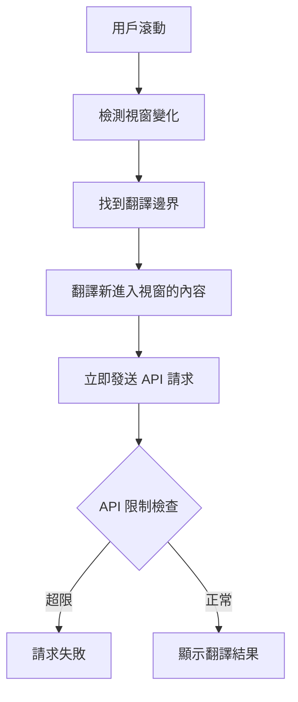
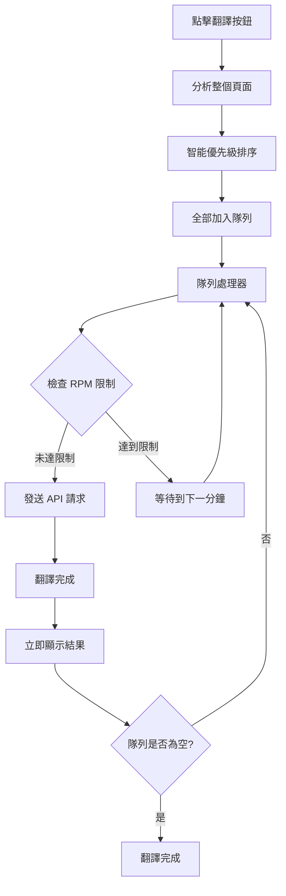

# 架構遷移：從視窗翻譯到智能排程系統

## 📋 **遷移概述**

我們正在從基於滾動觸發的視窗翻譯系統遷移到基於隊列的智能排程系統，以解決 API 配額限制問題並提升用戶體驗。

## 🔄 **系統對比**

### **舊系統：視窗內翻譯 (Viewport-based Translation)**



**問題：**
- ❌ 無法有效控制 API 請求頻率
- ❌ 用戶快速滾動時會產生大量並發請求
- ❌ 容易觸發 RPM 限制導致翻譯失敗
- ❌ 複雜的滾動邏輯和邊界檢測

### **新系統：智能翻譯排程 (Smart Translation Scheduling)**



**優勢：**
- ✅ 嚴格遵守 API 速率限制
- ✅ 可預測的翻譯進度和時間
- ✅ 智能優先級排序
- ✅ 更好的用戶反饋和控制

## 🏗️ **核心組件對比**

| 功能 | 舊系統 | 新系統 |
|------|--------|--------|
| **觸發方式** | 滾動事件 | 點擊按鈕 |
| **翻譯範圍** | 視窗內容 | 全頁面 |
| **請求控制** | 簡單節流 | 嚴格隊列 |
| **優先級** | 視窗順序 | 智能排序 |
| **進度反饋** | 基本狀態 | 詳細進度 |
| **錯誤處理** | 基本重試 | 智能恢復 |

## 📦 **新增核心類別**

### 1. **RateLimitedTranslationQueue**
```javascript
// 核心隊列管理和速率限制
class RateLimitedTranslationQueue {
    constructor(rpmLimit = 15) {
        this.rpmLimit = rpmLimit;
        this.queue = new Map();
        this.requestHistory = [];
        this.isProcessing = false;
    }
    
    enqueue(segment) { /* 智能入隊 */ }
    canSendRequest() { /* RPM 檢查 */ }
    getWaitTime() { /* 等待時間計算 */ }
    startProcessing() { /* 開始處理隊列 */ }
}
```

### 2. **SmartTranslationScheduler**
```javascript
// 智能排程和優先級管理
class SmartTranslationScheduler {
    scheduleFullPageTranslation() { /* 全頁面排程 */ }
    prioritizeSegments(segments) { /* 智能排序 */ }
    calculatePriority(segment) { /* 優先級計算 */ }
}
```

### 3. **TranslationProgressManager**
```javascript
// 進度追蹤和用戶反饋
class TranslationProgressManager {
    showProgress(current, total, currentSegment) { /* 進度顯示 */ }
    calculateEstimatedTime(remaining) { /* 時間預估 */ }
    updateButtonState(state) { /* 按鈕狀態 */ }
}
```

### 4. **RateLimitManager**
```javascript
// API 限制和配額管理
class RateLimitManager {
    constructor(apiLimits) {
        this.limits = apiLimits; // 支援不同 Gemini 模型
        this.dailyUsage = { requests: 0, tokens: 0 };
    }
    
    canSendRequest() { /* 多重限制檢查 */ }
    recordRequest(tokens) { /* 使用量記錄 */ }
    getQuotaStatus() { /* 配額狀態 */ }
}
```

## 🔧 **遷移步驟**

### **Phase 1: 核心隊列系統**
1. 實作 `RateLimitedTranslationQueue`
2. 實作 `RateLimitManager`
3. 基本的速率限制邏輯

### **Phase 2: 智能排程**
1. 實作 `SmartTranslationScheduler`
2. 全頁面分析和優先級排序
3. 隊列去重和優化

### **Phase 3: 用戶體驗**
1. 實作 `TranslationProgressManager`
2. 進度顯示和用戶控制
3. 錯誤處理和恢復

### **Phase 4: 系統整合**
1. 更新 `WebTranslationContent` 主類別
2. 替換舊的 `ViewportTranslationManager`
3. 確保向後兼容性

### **Phase 5: 測試和優化**
1. 功能測試和性能測試
2. 跨瀏覽器兼容性
3. 用戶體驗優化

## 📊 **預期改進**

### **API 使用效率**
- **舊系統**: 無法控制，容易超限
- **新系統**: 嚴格控制，最大化利用配額

### **用戶體驗**
- **舊系統**: 不可預測的翻譯速度
- **新系統**: 可預測的進度和完成時間

### **系統穩定性**
- **舊系統**: 頻繁的 API 錯誤
- **新系統**: 穩定的翻譯流程

### **維護性**
- **舊系統**: 複雜的滾動邏輯
- **新系統**: 清晰的隊列架構

## 🎯 **成功指標**

1. **API 錯誤率** < 1% (目前可能 > 10%)
2. **翻譯完成率** > 95%
3. **用戶滿意度** - 可預測的翻譯時間
4. **系統穩定性** - 無因 API 限制導致的崩潰

---

**這個遷移將大幅提升系統的可靠性和用戶體驗！** 🚀